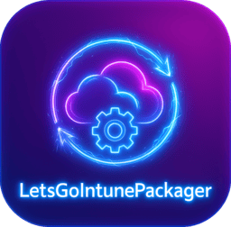

# LetsGoIntunePackager

<p align="center">
  
</p>

<p align="center">
  <strong>A cross-platform CLI tool to create <code>.intunewin</code> packages for Microsoft Intune Win32 app deployment.</strong>
</p>

<p align="center">
  <a href="#features">Features</a> •
  <a href="#installation">Installation</a> •
  <a href="#usage">Usage</a> •
  <a href="#examples">Examples</a> •
  <a href="#building">Building</a> •
  <a href="#contributing">Contributing</a>
</p>

---

## Overview

**LetsGoIntunePackager** is a Go-based alternative to Microsoft's official `IntuneWinAppUtil.exe`. It packages MSI/EXE installers into the encrypted `.intunewin` format required by Microsoft Intune for Win32 app deployment.

Unlike Microsoft's tool which only runs on Windows, LetsGoIntunePackager works on **Linux, macOS, and Windows** — making it perfect for CI/CD pipelines and cross-platform development workflows.

## Features

- **Cross-Platform**: Works on Linux, macOS, and Windows
- **Interactive TUI**: Beautiful terminal user interface for easy package creation
- **Quiet Mode**: CI/CD friendly with command-line flags for automation
- **MSI Metadata Extraction**: Automatically extracts Product Code, Version, Publisher, and more from MSI files
- **Progress Tracking**: Real-time progress updates during packaging
- **File Browser**: Built-in file picker for easy folder/file selection
- **100% Compatible**: Generates packages identical to Microsoft's official tool
- **Fast**: Written in Go for optimal performance

## Installation

### Pre-built Binaries

Download the latest release for your platform from the [Releases](https://github.com/michelbragaguimaraes/LetsGoIntunePackager/releases) page.

| Platform | Architecture | Download |
|----------|--------------|----------|
| Windows | x64 | `letsgointunepackager-windows-amd64.exe` |
| Windows | ARM64 | `letsgointunepackager-windows-arm64.exe` |
| macOS | Intel | `letsgointunepackager-darwin-amd64` |
| macOS | Apple Silicon | `letsgointunepackager-darwin-arm64` |
| Linux | x64 | `letsgointunepackager-linux-amd64` |
| Linux | ARM64 | `letsgointunepackager-linux-arm64` |

### Build from Source

```bash
# Clone the repository
git clone https://github.com/michelbragaguimaraes/LetsGoIntunePackager.git
cd LetsGoIntunePackager

# Build for your current platform
make build

# Or build for all platforms
make build-all
```

### Requirements

- **Go 1.23+** (only for building from source)
- No external dependencies required at runtime

## Usage

### Interactive Mode (Default)

Simply run the tool without arguments to launch the interactive TUI:

```bash
./letsgointunepackager
```

The TUI will guide you through:

1. **Welcome Screen**: Press `Enter` to start
2. **Input Screen**: Enter paths or use `Ctrl+O` to browse
   - Source folder containing your installer
   - Setup file name (auto-detected for MSI/EXE files)
   - Output folder for the `.intunewin` file
3. **Processing**: Watch real-time progress as your package is created
4. **Success**: View package details and create another or exit

#### TUI Keyboard Shortcuts

| Key | Action |
|-----|--------|
| `Tab` / `Shift+Tab` | Navigate between fields |
| `Ctrl+O` / `F2` | Open file browser |
| `Enter` | Confirm / Submit |
| `Esc` | Go back / Cancel |
| `q` | Quit |
| `↑` / `↓` | Navigate in file browser |

### Quiet Mode (CLI / CI/CD)

For automation and scripting, use quiet mode with command-line flags:

```bash
./letsgointunepackager --content /path/to/source --setup setup.msi --output /path/to/output --quiet
```

### Command-Line Flags

| Flag | Short | Description |
|------|-------|-------------|
| `--content` | `-c` | Source folder containing the setup file |
| `--setup` | `-s` | Setup file name (e.g., `setup.msi` or `install.exe`) |
| `--output` | `-o` | Output folder for the `.intunewin` file |
| `--quiet` | `-q` | Quiet mode - disable interactive UI |
| `--version` | `-v` | Show version information |
| `--help` | `-h` | Show help message |

## Examples

### Package an MSI Installer

```bash
# Interactive mode
./letsgointunepackager

# Quiet mode
./letsgointunepackager -c /apps/7zip -s 7z2401-x64.msi -o /output -q
```

### Package an EXE Installer

```bash
./letsgointunepackager -c /apps/vscode -s VSCodeSetup-x64.exe -o /packages -q
```

### Pre-populate TUI with Paths

You can provide flags without `-q` to pre-fill the TUI fields:

```bash
./letsgointunepackager -c /apps/myapp -s installer.exe -o /output
```

### CI/CD Pipeline Example (GitHub Actions)

```yaml
jobs:
  package:
    runs-on: ubuntu-latest
    steps:
      - uses: actions/checkout@v4

      - name: Download LetsGoIntunePackager
        run: |
          curl -L -o lgip https://github.com/michelbragaguimaraes/LetsGoIntunePackager/releases/latest/download/letsgointunepackager-linux-amd64
          chmod +x lgip

      - name: Create Intune Package
        run: |
          ./lgip -c ./installer -s MyApp.msi -o ./output -q

      - name: Upload Package
        uses: actions/upload-artifact@v4
        with:
          name: intune-package
          path: ./output/*.intunewin
```

## Package Structure

The generated `.intunewin` file follows Microsoft's official format:

```
MyApp.intunewin (ZIP archive - Store method)
└── IntuneWinPackage/
    ├── Contents/
    │   └── IntunePackage.intunewin    ← Encrypted content (AES-256-CBC)
    └── Metadata/
        └── Detection.xml               ← Encryption keys + app metadata
```

### Detection.xml Contents

The metadata file includes:

- **Application Info**: Name, setup file, unencrypted content size
- **Encryption Info**:
  - AES-256 encryption key (Base64)
  - HMAC-SHA256 MAC key (Base64)
  - Initialization Vector (Base64)
  - File digest (SHA256)
- **MSI Metadata** (for MSI files only):
  - `MsiProductCode`
  - `MsiProductVersion`
  - `MsiPackageCode`
  - `MsiUpgradeCode`
  - `MsiPublisher`
  - `MsiExecutionContext`
  - And more...

## Technical Details

### Encryption Scheme

LetsGoIntunePackager uses the same encryption as Microsoft's official tool:

1. **Compression**: Source folder → ZIP archive (Deflate)
2. **File Digest**: SHA256 hash of compressed data
3. **Key Generation**:
   - 32-byte AES encryption key (random)
   - 32-byte HMAC key (random)
   - 16-byte IV (random)
4. **Encryption**: AES-256-CBC with PKCS7 padding
5. **Authentication**: HMAC-SHA256 over `IV || Ciphertext`
6. **Output Format**: `[HMAC-32][IV-16][Ciphertext]`

### Compatibility

Generated packages are fully compatible with:

- Microsoft Intune Admin Center (portal)
- Microsoft Graph API for Intune
- IntuneWin32App PowerShell module
- Any tool that accepts `.intunewin` files

## Building from Source

### Prerequisites

- Go 1.23 or later
- Make (optional, for using Makefile)

### Build Commands

```bash
# Build for current platform
make build

# Build for all platforms (Linux, macOS, Windows)
make build-all

# Build with Windows icon/manifest (requires go-winres)
make winres
make build-all

# Run tests
make test

# Run tests with coverage report
make test-coverage

# Run linter
make lint

# Clean build artifacts
make clean

# Show all available commands
make help
```

### Adding a Windows Icon

1. Add `icon.png` (256x256 recommended) to `winres/` folder
2. Run `make winres` to generate Windows resources
3. Run `make build-all` to build with the icon embedded

## Project Structure

```
LetsGoIntunePackager/
├── cmd/
│   └── root.go              # Cobra CLI setup and commands
├── internal/
│   ├── packager/
│   │   ├── packager.go      # Main packaging orchestration
│   │   ├── encryption.go    # AES-256-CBC + HMAC-SHA256
│   │   ├── zipper.go        # ZIP compression utilities
│   │   ├── metadata.go      # Detection.xml generation
│   │   ├── msi.go           # MSI metadata extraction
│   │   └── *_test.go        # Unit tests
│   └── tui/
│       ├── tui.go           # TUI entry point
│       ├── model.go         # Application state
│       ├── update.go        # Message/event handling
│       ├── view.go          # Screen rendering
│       ├── keys.go          # Keyboard bindings
│       ├── styles.go        # Visual styling
│       ├── filepicker.go    # File browser logic
│       └── commands.go      # Async commands
├── winres/
│   ├── winres.json          # Windows resource config
│   └── icon.png             # Application icon
├── main.go                  # Entry point
├── go.mod                   # Go module definition
├── Makefile                 # Build automation
└── README.md                # This file
```

## Contributing

Contributions are welcome! Here's how to get started:

1. **Fork** the repository
2. **Create** your feature branch (`git checkout -b feature/amazing-feature`)
3. **Commit** your changes (`git commit -m 'Add amazing feature'`)
4. **Push** to the branch (`git push origin feature/amazing-feature`)
5. **Open** a Pull Request

### Development Guidelines

- Run `make fmt` before committing to format code
- Run `make test` to ensure all tests pass
- Run `make lint` to check for code issues
- Add tests for new functionality
- Update documentation as needed

## Troubleshooting

### Common Issues

**"Package not accepted by Intune"**
- Ensure you're using the latest version of LetsGoIntunePackager
- The tool now generates packages with `Store` compression (required by Intune)

**"MSI metadata not detected"**
- MSI files must be valid Windows Installer packages
- Some MSI files may have non-standard structures

**"Permission denied" on Linux/macOS**
- Run `chmod +x letsgointunepackager` to make the binary executable

**TUI not displaying correctly**
- Ensure your terminal supports ANSI colors
- Try a different terminal emulator
- Use `--quiet` mode as a workaround

## License

This project is licensed under the MIT License - see the [LICENSE](LICENSE) file for details.

## Author

**Mike Guimaraes**
Email: michelbragaguimaraes@gmail.com
GitHub: [@michelbragaguimaraes](https://github.com/michelbragaguimaraes)

## Acknowledgments

- Microsoft for the IntuneWinAppUtil specification and `.intunewin` format
- [Charmbracelet](https://charm.sh/) for the excellent TUI libraries:
  - [Bubble Tea](https://github.com/charmbracelet/bubbletea) - TUI framework
  - [Bubbles](https://github.com/charmbracelet/bubbles) - TUI components
  - [Lip Gloss](https://github.com/charmbracelet/lipgloss) - Style definitions
- [Cobra](https://cobra.dev/) for the CLI framework
- [go-msi](https://github.com/gabriel-vasile/mimetype) for MSI parsing inspiration

## Disclaimer

This is an **unofficial** tool and is not affiliated with, endorsed by, or supported by Microsoft Corporation. Microsoft, Intune, and Windows are trademarks of Microsoft Corporation.

Use at your own risk. Always test packages in a non-production environment before deployment.

---

<p align="center">
  Made with ❤️ by <a href="https://github.com/michelbragaguimaraes">Mike Guimaraes</a>
</p>
